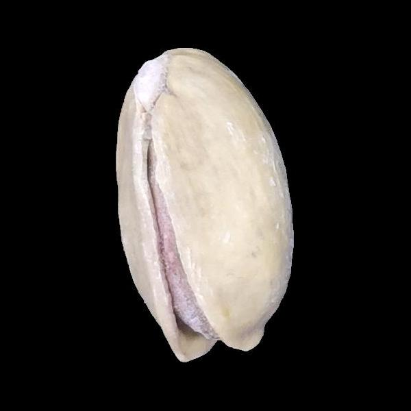
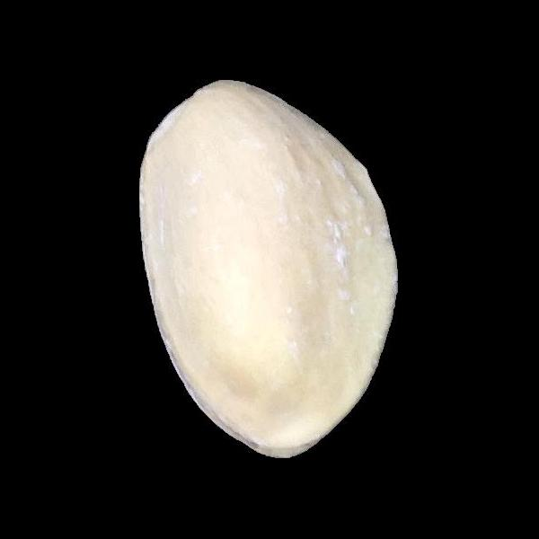
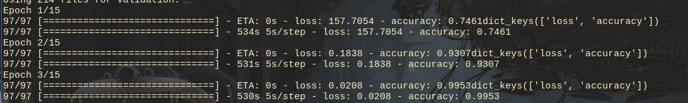

# Pistachio Detective
I am learning Tensorflow so I thought an interesting application of my efforts would be to go online, find a data set, and do some basic image classification. 

### Kirmizi Pistachi: 

### Siirt Pistachi: 

## Progress
1. I implemented V1.0 with a custom callback function. I was pretty proud of my model because it was reaching 99% accuracy. 
2. I realized that I was measuring accuracy on the test set, but not on the validation set. I updated the code and only got up to 80% accuracy. 
3. I added some more layers for convolutions and pooling in an attempt to avoid  overfitting, but only got to about 85% accuracy on the validation set whereas the training set was seeing almost 100% accuracy. 
4. The new strategy is to use `ImageDataGenerator` to augment the images. If needed, I'll make use of dropouts.

## Technical Objectives
1. Make use of a Convolutional Neural Network. This is one of the requirements for the Tensorflow certification, but I'm generally interested in images and ML, so I thought it'd be worth practicing. 
2. Implementing a callback function to control epochs. I really don't want to overfit data, and callbacks seem to be a great way to do this. Along the way, I learned more about how `model.fit()` works.
3. Achieve reasonable accuracy, 90% is good enough for this data set of only 2.4k images. 
4. Use `ImageDataGenerator` to augment images.

### Callback Function at Work

## Data Set Used
I used the data set on the first link:
[Pistachio Data Set](https://www.muratkoklu.com/datasets/)
